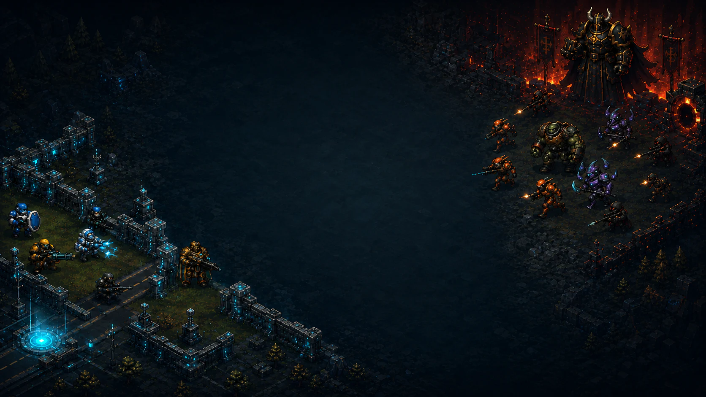

# ALL-IN DEFENSE

> 포커 족보가 방어선을 결정하는 무한 웨이브 디펜스

<p align="center">
  <a href="https://jaeshikyoon.github.io/all-in-defense/">
    
  </a>
</p>

<p align="center">
  <a href="https://jaeshikyoon.github.io/all-in-defense/"><strong>▶ 플레이하기</strong></a>
  ·
  <a href="./docs/game-introduction.md">게임 소개 문서</a>
  ·
  <a href="./docs/ai-usage.md">AI 활용 기술 문서</a>
</p>

<p align="center">
  
  
  
  
</p>



## 게임 한눈에 보기

ALL-IN DEFENSE는 32장 포커와 실시간 타워 디펜스를 결합한 브라우저 게임입니다. 매 PHASE가 끝나면 5장의 카드를 받고 최대 3장을 교체해 족보를 완성합니다. 완성한 족보는 곧바로 전투 병종과 보상 수량으로 변환됩니다.

좋은 패는 강한 병종을 만들고, 나쁜 패는 배치와 합성으로 보완해야 합니다. 적을 모두 제거해야만 끝나는 방식이 아니라, 예정된 투입이 끝나면 다음 포커 드로우로 넘어갑니다. 살아남은 적은 다음 PHASE에도 전장에 남기 때문에 매 선택이 누적되는 구조입니다.

### 핵심 루프

```text
포커 드로우 → 카드 교체 → 족보 공개 → T1 유닛 획득
      ↑                                      ↓
다음 PHASE ← 적 투입·전투 ← 전장 배치·합성
```

### 족보와 병종

| 족보 | 보상 병종 | 전투 역할 |
| --- | --- | --- |
| 하이 카드 | 예비군 | 최소 방어 전력 |
| 원 페어 | 소총병 | 안정적인 단일 대상 처리 |
| 투 페어 | 기관총병 | 보병·돌격병 제압 |
| 트리플 | 빙결술사 | 범위 감속과 군중 제어 |
| 스트레이트 | 저격수 | 강적 처형 |
| 플러시 | 폭파병 | 밀집 적 광역 공격 |
| 풀 하우스 | 박격포 | 넓은 장거리 광역 공격 |
| 포카드 | 테슬라 기사 | 연쇄 공격 |
| 스트레이트 플러시 | 레일건 | 정예·저거너트 초고위력 |
| 로열 플러시 | 대재앙포 | 후반 경량 적 소탕 |

모든 보상은 T1으로 지급되며, 같은 병종·티어 유닛을 합성해 T2~T4로 강화할 수 있습니다. 합성의 비용은 화력 손실이 아니라 배치 지점과 목표 분산 능력의 감소입니다.

## 주요 기능

- **32장 포커**: 7, 8, 9, 10, J, Q, K, A × 4문양
- **무한 PHASE**: PHASE가 지날수록 적 조합과 체력이 상승
- **다중 경로 전장**: 여러 입구가 하나의 출구로 합류하는 경로 지원
- **그리드 기반 MAP BUILDER**: 맵 크기, 바닥 재질, 지형, 건물, 경로를 편집
- **정확한 셀 스냅**: 경로·건물·지형을 그리드 셀 기준으로 배치
- **에셋 교체 배치**: 기존 건물·지형을 선택한 에셋으로 교체하고 바닥은 독립 레이어로 유지
- **3줄 이동 레인**: 적이 한 줄이 아니라 경로를 따라 세 개의 레인으로 이동
- **유닛 조작**: 단일 클릭 선택, 드래그 다중 선택, 이동, 합성, 공격 범위 확인
- **전투 편의 기능**: 1×/2×/4× 배속, 일시정지, 줌, 사운드 볼륨 조절
- **로컬 기록**: IndexedDB 기반 맵 저장·복제·JSON 입출력과 맵별 킬 랭킹
- **반응형 UI**: 데스크톱과 가로 모바일 화면 지원

## 플레이 방법

1. 메인 화면에서 전장을 선택하고 `게임 시작`을 누릅니다.
2. 포커 화면에서 교체할 카드를 선택한 뒤 결과를 확인합니다.
3. 획득한 유닛을 빈 전장에 배치합니다. 잘못된 위치를 눌러도 보상 유닛은 사라지지 않습니다.
4. `적 투입 시작`을 눌러 PHASE를 진행합니다.
5. 전투 중 유닛을 클릭하거나 드래그해 이동·다중 선택·합성을 사용합니다.
6. 게이트가 파괴되기 전에 최대한 많은 적을 처치하고 기록을 갱신합니다.

### 조작 요약

| 입력 | 동작 |
| --- | --- |
| 클릭 | 유닛 선택 / 배치 |
| 드래그 | 다중 선택 / 맵 빌더 연속 배치 |
| 우클릭 또는 Shift 드래그 | 카메라 이동 |
| 휠·핀치 | 줌 인·아웃 |
| 일시정지 버튼 | 전투 중 모든 시뮬레이션 정지 |

## MAP BUILDER

맵 빌더의 모든 배치는 2×2 월드 단위 그리드에 정렬됩니다. 바닥 재질은 셀마다 하나만 유지되지만 건물·지형은 그 위에 배치할 수 있습니다. 2×2 건물은 인접 셀을 눌러도 다음 빈 풋프린트로 자동 스냅됩니다.

맵은 브라우저의 IndexedDB에 저장되며, JSON으로 내보내 다른 환경에서 불러올 수 있습니다. 현재 랭킹도 서버 없이 맵 ID와 리비전별로 로컬에 기록됩니다.

## 실행 방법

```bash
npm install
npm run dev
```

개발 서버는 Vite로 실행됩니다. 프로덕션 검증은 다음 명령으로 수행합니다.

```bash
npm test
npm run build
```

온라인 플레이 빌드: **https://jaeshikyoon.github.io/all-in-defense/**

## 기술 구성

- React 19 + TypeScript
- PixiJS 8 기반 2D 렌더링 및 전투 FX
- Vite 빌드 시스템
- IndexedDB 맵·랭킹 저장
- Web Audio API 기반 효과음·절차적 배경음
- Vitest 단위 테스트: 포커 판정, 전투 엔진, 저장소, 오디오, 경계 구조, UI 규칙

## 에셋 파이프라인

캐릭터·적·건물·지형·바닥·UI 에셋은 게임의 군사 SF 아트 방향에 맞춰 생성한 뒤, 투명 배경 제거와 크기 정규화를 거쳐 런타임 PNG/WebP로 변환했습니다. 상세 출처와 처리 과정은 [`docs/asset-sources.md`](./docs/asset-sources.md)에 기록되어 있습니다.

## 문서

- [`docs/game-introduction.md`](./docs/game-introduction.md) — 제출용 게임 소개·플레이·실행 방법
- [`docs/ai-usage.md`](./docs/ai-usage.md) — AI 도구·프롬프트·검증·활용 내역
- [`docs/poker-unit-balance.md`](./docs/poker-unit-balance.md) — 포커 족보와 유닛 밸런스
- [`docs/unit-damage-balance.md`](./docs/unit-damage-balance.md) — 티어별 공격력 기준
- [`docs/asset-sources.md`](./docs/asset-sources.md) — 에셋 출처와 가공 파이프라인

## 라이선스 및 참고

이 저장소는 게임 제출과 포트폴리오 검토를 위한 프로젝트입니다. 포함된 캐릭터와 환경 에셋은 본 프로젝트용으로 제작된 원본 리소스이며 외부 상용 게임 에셋을 번들하지 않습니다.
